# Data Lovers

## 1. Objetivos de aprendizaje 

Vanya Xel Jimenez Sanpedro

### UX

- [x] Diseñar la aplicación pensando y entendiendo al usuario.
- [x] Crear prototipos para obtener _feedback_ e iterar.
- [x] Aplicar los principios de diseño visual (contraste, alineación, jerarquía).
- [ ] Planear y ejecutar _tests_ de usabilidad.

### HTML y CSS

- [x] Entender y reconocer por qué es importante el HTML semántico.
- [x] Identificar y entender tipos de selectores en CSS.
- [ ] Entender como funciona `flexbox` en CSS.
- [x] Construir tu aplicación respetando el diseño planeado (maquetación).

### DOM

- [x] Entender y reconocer los selectores del DOM (querySelector | querySelectorAll).
- [x] Manejar eventos del DOM. (addEventListener)
- [x] Manipular dinámicamente el DOM. (createElement, appendchild, innerHTML, value)

### Javascript

- [ ] Manipular arrays (`filter` | `map` | `sort` | `reduce`).
- [ ] Manipular objects (key | value).
- [x] Entender el uso de condicionales (`if-else` | `switch`).
- [x] Entender el uso de bucles (`for` | `forEach`).
- [x] Entender la diferencia entre expression y statements.
- [x] Utilizar funciones (parámetros | argumentos | valor de retorno).
- [ ] Entender la diferencia entre tipos de datos atómicos y estructurados.
- [x] Utilizar ES Modules (`import` | `export`).

### Pruebas Unitarias (_testing_)
- [ ] Testear funciones (funciones puras).

### Git y GitHub
- [x] Ejecutar comandos de git (`add` | `commit` | `pull` | `status` | `push`).
- [x] Utilizar los repositorios de GitHub (`clone` | `fork` | gh-pages).
- [x] Colaborar en Github (pull requests).

### Buenas prácticas de desarrollo
- [x] Organizar y dividir el código en módulos (Modularización).
- [ ] Utilizar identificadores descriptivos (Nomenclatura | Semántica).
- [ ] Utilizar linter para seguir buenas prácticas (ESLINT).

Yazmin Tepale

### UX

- [ ] Diseñar la aplicación pensando y entendiendo al usuario.
- [ ] Crear prototipos para obtener _feedback_ e iterar.
- [ ] Aplicar los principios de diseño visual (contraste, alineación, jerarquía).
- [ ] Planear y ejecutar _tests_ de usabilidad.

### HTML y CSS

- [ ] Entender y reconocer por qué es importante el HTML semántico.
- [ ] Identificar y entender tipos de selectores en CSS.
- [ ] Entender como funciona `flexbox` en CSS.
- [ ] Construir tu aplicación respetando el diseño planeado (maquetación).

### DOM

- [ ] Entender y reconocer los selectores del DOM (querySelector | querySelectorAll).
- [ ] Manejar eventos del DOM. (addEventListener)
- [ ] Manipular dinámicamente el DOM. (createElement, appendchild, innerHTML, value)

### Javascript

- [ ] Manipular arrays (`filter` | `map` | `sort` | `reduce`).
- [ ] Manipular objects (key | value).
- [ ] Entender el uso de condicionales (`if-else` | `switch`).
- [ ] Entender el uso de bucles (`for` | `forEach`).
- [ ] Entender la diferencia entre expression y statements.
- [ ] Utilizar funciones (parámetros | argumentos | valor de retorno).
- [ ] Entender la diferencia entre tipos de datos atómicos y estructurados.
- [ ] Utilizar ES Modules (`import` | `export`).

### Pruebas Unitarias (_testing_)
- [ ] Testear funciones (funciones puras).

### Git y GitHub
- [ ] Ejecutar comandos de git (`add` | `commit` | `pull` | `status` | `push`).
- [ ] Utilizar los repositorios de GitHub (`clone` | `fork` | gh-pages).
- [ ] Colaborar en Github (pull requests).

### Buenas prácticas de desarrollo
- [ ] Organizar y dividir el código en módulos (Modularización).
- [ ] Utilizar identificadores descriptivos (Nomenclatura | Semántica).
- [ ] Utilizar linter para seguir buenas prácticas (ESLINT).

## 2. Definición del producto

La producto diseñado es una aplicación complementaria diseñada para cubrir las necesidades de los usuarios de POKEMON GO!, basandonos en la investigacion previa al diseño, en la cual realizamos entrevistas a usuarios, en la cual realizamos diversas preguntas que nos ayudaron a comprender las deficiencias de la aplicación POKEMON GO!, por lo que al analizar los datos obtuvimos las caracteristicas generales de nuestro proyecto.

El proceso del diseño fue se realizo basandonos en 2 aspectos, el primero en la aplicación existente, la cual ya tiene una paleta de colores, que decidimos retomar y la segunda en las necesidades de los usuarios, tratando de dar un flujo facil y entendible entre secciones.

Las historias de usuario los obtuvimos a través de una pequeña encuesta realizada a usuarios que utilizaron la app de Pokémon GO: https://docs.google.com/forms/d/1E-ZNG-C0kr7ATXNQzxhebduaQpY8iFibS2B6_3r5wP0/edit

### Historias de usuario

**Historia 1**

Cómo: Usuario de Pokémon GO!
Quiero: Jugar sin internet
Para: Ahorrar datos

Criterios de aceptación:

1.- El usuario habilita la opción de juego offline en menú.

TAREAS:
1.1 Crear botón dentro del menú

**Historia 2**

Como: Usuario de Pokémon GO!
Quiero: Un pokémon mascota
Para: Acompañamiento en misiones

Criterios de aceptación:

1.- El usuario ingresa a su catálogo de pokémones
2.- Elige desde su catálogo el pokémon que desea de acompañante.
3.- Visualiza caracteristicas del pokemon para una mejor elección 
4.- Seleccionar pokémon

TAREAS:
2.1 Crear opción del catálogo 
2.2 Agregar características del pokémon 
2.3 Diseñar tarjetas para visualizar al pokémon y características.

**Historia 3**

Como:Usuario de Pokémon GO!
Quiero: Acceder a la plataforma 
Para: Poder jugar

Criterios de aceptación:

Abrir app
2.- Seleccionar Crear cuenta o iniciar sesión
3.- Dar opción de incio o registro con RR.SS o cuenta de correo electrónico y contraseña
4.- Verificar cuenta con código enviado a correo o teléfono celular
5.- El acceso del usuario deberá ser en cualquier dispositivo

TAREAS:

3.1  Crear pantalla con opciones de registro por RR.SS o creación de una cuenta
3.2  Crear pantalla para creación de contraseña y verificación del usuario 
3.3 Opción de enviar código a dispositivo móvil o correo 
3.4 Botón de crear/ingreso de usuario

**Historia 4**

Como: Usuario de Pokémon GO!
Quiero: Una versión LITE 
Para: Ahorro de espacio 

Criterios de aceptación:

1.- El usuario encuentra la opción de descarga de la versión lite en menú
2.- Redirigir a la tienda para descarga de la app

TAREAS:

4.1 Crear botón de redirección a página de descargas/compras

**Historia 5**

Como:Usuario de Pokémon GO!
Quiero: Filtar a mis pokemones por tipo, poder de ataque, debilidad, etc. 
Para: Elegir el mejor en misiones/batallas

Criterios de aceptación:

1.- Que el usuario visualice su catalogo 
2.- Filtre sus pokémones por tipo, poder de ataque, debilidad, etc 
3.- Seleccionar a pokémon para misiones/batallas

Tareas
7.1 Agregar catalogo a menú 
7.2 Diseñar tarjeta para poder visualizar pokémon/características
7.3 Agregar opción de filtrado (lista y ordenar)
7.4 Agregar más características del pokémon 
7.5 Añadir botón para hacer la elección del pokémon

**Historia 6**

Como:Usuario de Pokémon GO!
Quiero: Conocer características de mis pokemones
Para: Elegir el mejor en misiones/batallas

Criterios de aceptación:

1.- Que el usuario visualice su catalogo 
2.- Visualice sus características 
3.- Elija el pokémon que desea para misiones/batallas

Tareas
6.1 Agregar catalogo a menú 
6.2 Diseñar tarjeta para poder visualizar pokémon/características
6.3 Agregar más características del pokémon 
6.4 Añadir botón para hacer la elección del pokémon

**Historia 7**

Como:Usuario de Pokémon GO!
Quiero: Sugerir zonas de centros pokémon
Para: Adquirir más productos (pokebolas, polvo estelar,etc)

Criterios de aceptación:

1.- El usuario abra el menú de opción para sugerencia de creación de centro pokémon
2.- Pueda visualizar el menú de zonas cercanas al usuario 
3.- Que el usuario pueda ver la popularidad por zona
4.- Que el usuario vote por la zona que elija
5.- Que el usuario active datos para hacer votación 

Tareas

5.1 Agregar opción al menú para sugerencias de creación del centro pokémon 
5.2 Agregar mapa para visualizar zonas cercanas con votos
5.3 Agregar botón para visualizar el # de votaciones 
5.4 Agregar botón para votar por zona
5.5 Agregar un mensaje para activar modo online

### Diseño de la Interfaz de Usuario

#### Prototipo de baja fidelidad

#### Prototipo de alta fidelidad
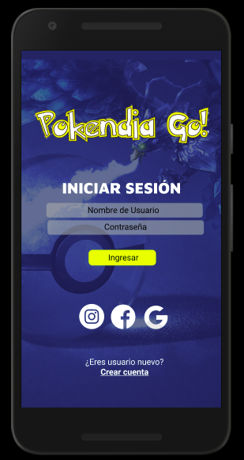
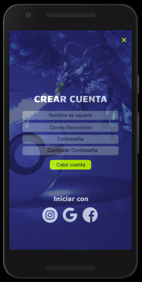
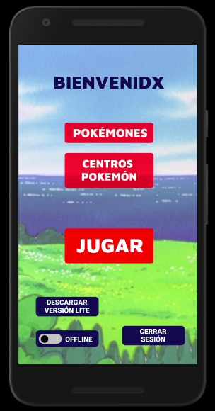
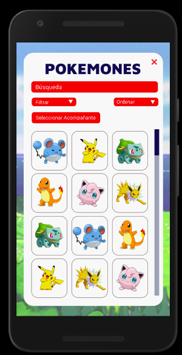
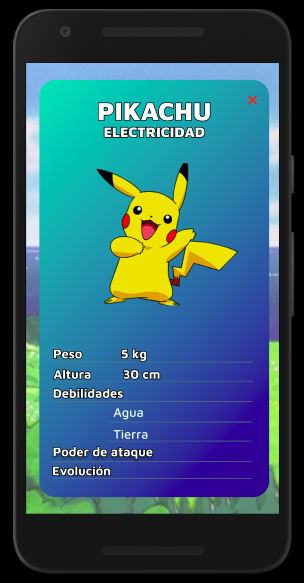
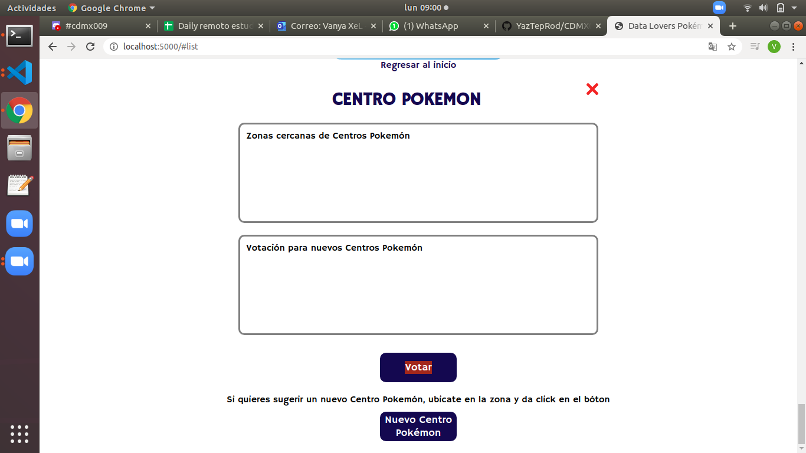

#### Testeos de usabilidad

Realizamos diferentes testeos de usabilidad, en diferentes partes del proceso, recibimos feedback, con lo que nos ayudo a mejorar la experiencia de usuario. Los testeos se realizaron con coaches, compañeras y amigos.

 A continuacion enlistaremos algunos de los comentarios recibidos:

Primer feedback
- Dejar una sola imagen de RR.SS 
- Descripción en los botones de votación y catálogo 
- Hacer más pequeña la pantalla de tarjeta de los pokemones

Segundo Feedback

- Agregar iconos de RR.SS
- Dejar inicio de sesión y la creación de cuenta en una sola pantalla
- Centrado en los textos de iniciar sesión y crear cuenta 
- Despegar un poco los botones del borde de la pantalla darle contraste a las letras de las tarjetas de los pokemones

#### Producto Final

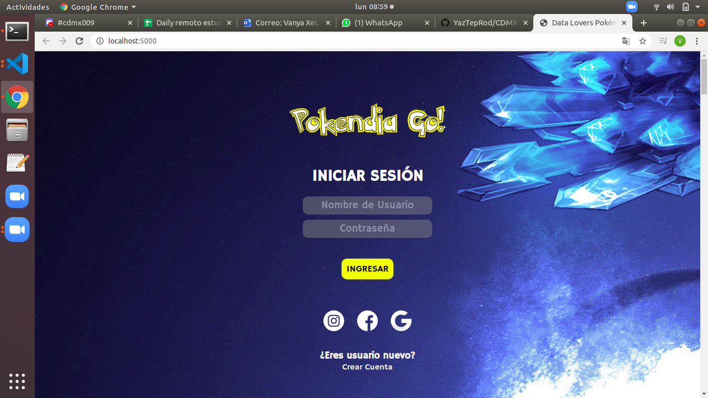
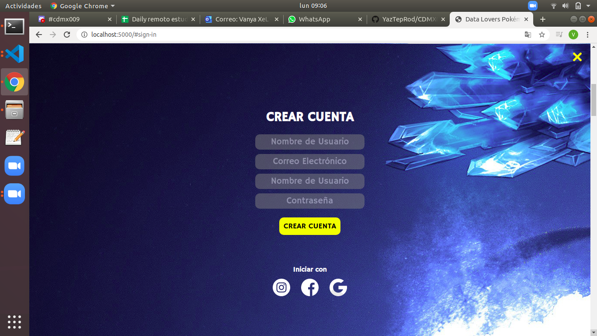
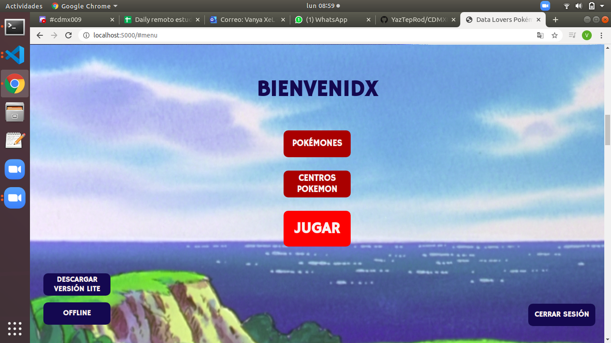
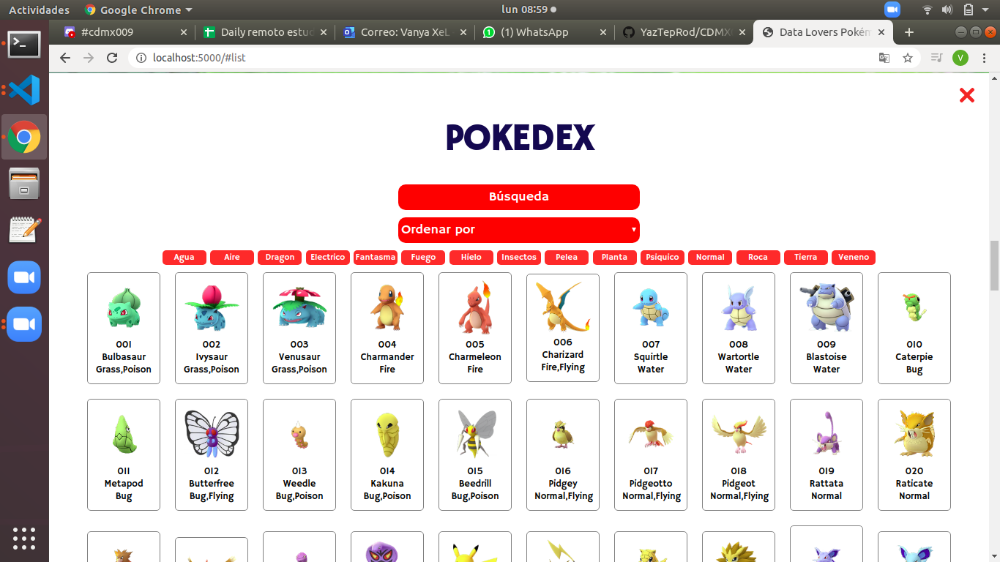
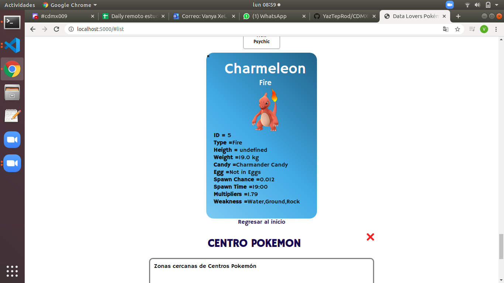

